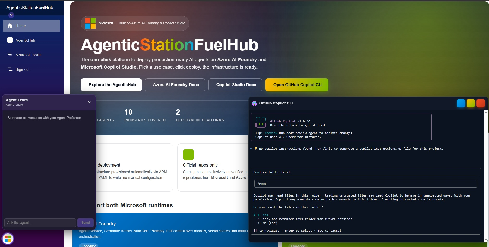

# AgentStationHub

> **Fully autonomous AI-agent-driven Azure deployments** — from a GitHub repo URL to a live, verified Azure environment. No manual steps.



---

## What it does

AgentStationHub is a .NET 8 Blazor Server application that orchestrates end-to-end Azure deployments using AI agent teams. You pick a repo from the curated catalog (or scan GitHub for new ones), click **Agentic Deploy**, and the system:

1. **Clones** the repo into a Docker sandbox
2. **Inspects** the codebase (language, IaC, manifests)
3. **Plans** the deployment via a multi-agent team (Scout → TechClassifier → Strategist → SecurityReviewer)
4. **Awaits your approval** — nothing executes until you say so
5. **Executes** the plan step-by-step with live logs streamed via SignalR
6. **Self-heals** failures with a Doctor agent (up to 8 remediation attempts)
7. **Verifies** the deployment (Container App health, endpoint reachability)
8. **Auto-fixes infrastructure** — post-deploy `InfraAutofix` agent reviews ALL deployed Azure resources and remediates issues

---

## Architecture

```
┌─────────────────────────────────────────────────────────────────┐
│                        Azure VM (Ubuntu)                         │
│                                                                  │
│  ┌──────────┐   ┌───────────────────┐   ┌───────────────────┐  │
│  │  Caddy   │──▶│  AgentStationHub  │   │  Copilot CLI      │  │
│  │ TLS/443  │   │  Blazor :8080     │   │  ttyd sidecar     │  │
│  └──────────┘   └────────┬──────────┘   └───────────────────┘  │
│                           │                                      │
│                    Docker Socket (DooD)                           │
│                           │                                      │
│               ┌───────────▼───────────┐                          │
│               │  Sandbox Containers   │  (ephemeral, per-deploy) │
│               │  agentichub/sandbox   │                          │
│               └───────────────────────┘                          │
└─────────────────────────────────────────────────────────────────┘
```

| Component | Purpose |
|-----------|---------|
| **AgentStationHub** | Blazor Server host — UI, orchestrator, SignalR hub, Foundry client |
| **AgentStationHub.SandboxRunner** | Console app inside sandbox containers — runs planning/remediation agents |
| **Sandbox containers** | Ephemeral peers spawned via `/var/run/docker.sock` (Docker-out-of-Docker) |
| **Caddy** | TLS termination, Let's Encrypt auto-cert, security headers |
| **Copilot CLI sidecar** | ttyd terminal with `gh` + GitHub Copilot CLI |

---

## Key Features

### 🚀 Agentic Deploy

Curated catalog of Azure AI agent repos with **Scan the web** to discover new ones from GitHub. Each deploy runs in an isolated Docker sandbox with:

- Multi-agent planning (4 specialized agents)
- Plan validation and security review before execution
- Self-healing Doctor agent for failure remediation
- Live streaming logs via SignalR
- Deterministic auto-patches for known failure patterns

### 🔧 InfraAutofix (Post-Deploy)

After a successful deployment, the `InfraAutofixAgent` discovers **every Azure resource** in the target Resource Group and applies universal checks:

| Check | Auto-Fix |
|-------|----------|
| Provisioning state ≠ Succeeded | Report |
| Public network access disabled | Enable |
| Service stopped (App Service, PostgreSQL) | Start |
| No active Container App revisions | Create new revision |
| AZURE_CLIENT_ID mismatch with assigned MI | Correct env var |
| Endpoint unreachable (HTTP 5xx) | Report |
| AI model deployments missing | Report |
| CosmosDB public network disabled | Enable |
| Key Vault / App Config / ACR network blocked | Enable |

**Supported services** (16 types):

Container Apps · Container App Environments · App Service / Functions · Storage Accounts · CosmosDB · Cognitive Services / AI Foundry · AI Search · Key Vault · App Configuration · Container Registry · Redis Cache · Service Bus · Event Hubs · SQL Server · PostgreSQL Flexible Server · SignalR

Any unrecognized resource type still gets a provisioning-state check.

### 📚 Agent Learn

Floating chat avatar powered by a Foundry hosted agent (`AgentMicrosoftLearn`). Recommends Microsoft Learn modules, certifications, and courses grounded on official docs via the Microsoft Learn MCP server.

### 💻 GitHub Copilot CLI

Floating terminal pill embedding a real ttyd session with `gh` and Copilot CLI, reverse-proxied through the Hub's authenticated origin.

---

## Deployment Pipeline

```
Clone → Inspect → Plan → Approve → Execute → Verify → InfraAutofix
                                       │
                                       ├── On failure: Doctor agent (self-heal)
                                       ├── On escalation: EscalationResolver (LLM-driven)
                                       └── Deterministic auto-patches (known patterns)
```

### Self-Healing Stack

When a step fails, the orchestrator applies fixes in this order:

1. **Deterministic auto-patches** — regex-based pattern matching for known ARM errors (deprecated models, invalid secrets, zone-redundant capacity, region collisions)
2. **In-sandbox Doctor** — reasoning model (`o4-mini`) with full workspace access
3. **EscalationResolver** — LLM-driven last-line resolver for novel failures
4. **Foundry-hosted Doctor** — optional hosted variant with portal-editable instructions

---

## Hosting

Runs exclusively on a dedicated Azure VM. `start.ps1` provisions and manages the full lifecycle:

```powershell
# First run: provisions VM + Docker + compose
pwsh .\start.ps1 -Bootstrap

# Subsequent: sync + redeploy
pwsh .\start.ps1

# Stop (deallocate, billing stops)
pwsh .\stop.ps1

# Destroy everything
pwsh .\stop.ps1 -Destroy
```

Public access: `https://agentichub-host.eastus2.cloudapp.azure.com` — gated by cookie-based login.

---

## Configuration

### Required Environment Variables (`.env` on VM)

| Variable | Purpose |
|----------|---------|
| `AZURE_CLIENT_ID` / `AZURE_CLIENT_SECRET` / `AZURE_TENANT_ID` | Service principal for Azure operations |
| `AUTH_USERNAME` / `AUTH_PASSWORD` | Login credentials for the web UI |
| `PUBLIC_FQDN` | Hostname for Let's Encrypt cert |
| `CADDY_ACME_EMAIL` | ACME account email |

### `appsettings.Development.json` (gitignored)

```jsonc
{
  "AzureOpenAI": {
    "Endpoint": "https://<resource>.openai.azure.com/",
    "Deployment": "gpt-5.4",
    "StrategistDeployment": "ash-strategist",
    "DoctorDeployment": "ash-doctor",
    "VerifierDeployment": "ash-verifier"
  }
}
```

---

## Development

```powershell
# Build
cd AgentStationHub
dotnet build --nologo -v q

# Deploy to VM after push
az vm run-command invoke -g rg-agentichub-host -n agentichub-host `
  --command-id RunShellScript `
  --scripts "cd /home/azureuser/agentichub && git checkout -- . && git pull origin master && docker compose build agentichub && docker compose up -d --force-recreate --no-deps agentichub"
```

---

## Solution Layout

```
AgentStationHub/
├── Components/Pages/Hub.razor          # Deployment catalog UI
├── Hubs/DeploymentHub.cs               # SignalR streaming
├── Models/
│   ├── DeploymentSession.cs            # Session state
│   └── AutofixReport.cs               # InfraAutofix report DTOs
├── Services/
│   ├── DeploymentOrchestrator.cs       # Core state machine + AutoPatch
│   ├── Agents/
│   │   ├── InfraAutofixAgent.cs        # Post-deploy infra review (all Azure services)
│   │   ├── PlanExtractorAgent.cs       # Host-side fallback planner
│   │   ├── VerifierAgent.cs            # Post-deploy verification
│   │   └── EscalationResolverAgent.cs  # LLM-driven last-line resolver
│   ├── Security/
│   │   ├── PlanValidator.cs            # Command allow/deny lists
│   │   └── CommandSafetyGuard.cs       # Pre-flight correctness guard
│   └── Tools/
│       ├── SandboxImageBuilder.cs      # Baked scripts + Dockerfile gen
│       ├── DockerShellTool.cs          # Per-step exec driver
│       ├── SandboxSession.cs           # Container lifecycle
│       └── AutofixReportStore.cs       # JSON report persistence
└── wwwroot/

AgentStationHub.SandboxRunner/
├── Team/PlanningTeam.cs                # Scout → Classifier → Strategist → Reviewer
└── Team/DoctorToolbox.cs               # In-sandbox remediation tools
```

---

## Sandbox Image (v40)

Built on demand by `SandboxImageBuilder`. Base: `mcr.microsoft.com/azure-cli:latest` plus:

- .NET 8 runtime, Node 20 LTS, Python 3, Git, jq
- `azd` (Azure Developer CLI)
- `gh` (GitHub CLI 2.63.2)
- `agentic-*` helper toolbox (finite single-token commands for plans)
- `uv` (Python package manager)

---

## Models

| Component | Model | Purpose |
|-----------|-------|---------|
| Strategist | `ash-strategist` | Deployment plan generation |
| Doctor | `ash-doctor` (o4-mini) | Self-healing remediation |
| Verifier | `ash-verifier` | Post-deploy verdict |
| PlanExtractor | `gpt-5.4` | Host-side fallback planner |
| EscalationResolver | `ash-doctor` | Novel failure resolution |
| Agent Learn | `gpt-4.1-mini` | Microsoft Learn recommendations |

---

## Security

- No secrets in source — environment variables or Azure Key Vault
- `DefaultAzureCredential` for all Azure SDK calls
- Cookie-based auth gates every route (`/login`)
- Sandbox containers run with capped memory/swap
- `PlanValidator` blocks dangerous commands before execution
- `CommandSafetyGuard` pre-flight rejects known-bad patterns
- TLS via Let's Encrypt (Caddy auto-renewal)
- HSTS, X-Content-Type-Options, X-Frame-Options headers

---

## License

MIT
